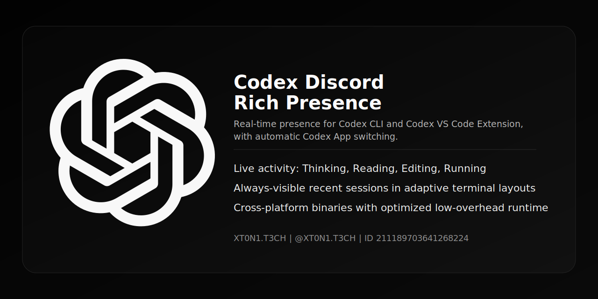
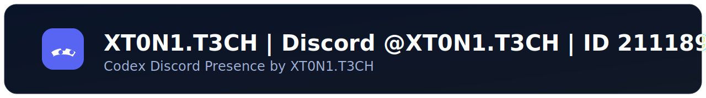

# Codex Discord Presence

<p align="center">
  
</p>

<p align="center">
  <a href="https://github.com/xt0n1-t3ch/Codex-Discord-Rich-Presence/actions/workflows/ci.yml"></a>
  <a href="https://github.com/xt0n1-t3ch/Codex-Discord-Rich-Presence/releases"></a>
  <a href="LICENSE"></a>
  
  
</p>

<p align="center"><strong>Real-time Discord Rich Presence for Codex CLI sessions.</strong></p>

## Overview

`codex-discord-presence` reads local Codex session JSONL files (`~/.codex/sessions`), detects live activity (`Thinking`, `Reading`, `Editing`, `Running`, `Waiting for input`), renders an adaptive terminal dashboard, and updates Discord Rich Presence with low overhead.

## Core Capabilities

- Stable multi-session detection with anti-false-idle behavior.
- Always-visible `Recent Sessions` section with adaptive compact fallback.
- Action-first Discord details/state with deterministic truncation.
- Semantic remaining-limit bars (`5h`, `7d`) with color thresholds.
- Incremental parse cache and render/publish dedupe for low CPU and memory use.

## Install

### Build from source

```bash
cargo build --release
```

Binary output:

- Windows: `dist/windows/x64/codex-discord-presence.exe`
- Linux: `dist/linux/x64/codex-discord-presence`
- macOS x64: `dist/macos/x64/codex-discord-presence`
- macOS arm64: `dist/macos/arm64/codex-discord-presence`

### Download release binaries

- Releases: `https://github.com/xt0n1-t3ch/Codex-Discord-Rich-Presence/releases`

## Usage

```bash
codex-discord-presence
codex-discord-presence codex [args...]
codex-discord-presence status
codex-discord-presence doctor
```

## Configuration

Config file:

- `~/.codex/discord-presence-config.json`

Defaults:

- `schema_version`: `3`
- `discord_client_id`: `1470480085453770854`
- `display.large_image_key`: `codex-logo`
- `display.small_image_key`: `openai`
- `poll_interval_seconds`: `2`
- `active_sticky_window_seconds`: `3600` (runtime env)

Environment overrides:

- `CODEX_DISCORD_CLIENT_ID`
- `CODEX_PRESENCE_STALE_SECONDS`
- `CODEX_PRESENCE_POLL_SECONDS`
- `CODEX_PRESENCE_ACTIVE_STICKY_SECONDS`
- `CODEX_HOME`

## Discord Asset Setup

1. Open Discord desktop app.
2. In Discord Developer Portal, configure image assets:
   - `codex-logo` (large image)
   - `openai` (small image fallback)
3. Optional: add per-activity small image keys in config (`display.activity_small_image_keys`).

## Documentation

- API: `docs/api/codex-presence.md`
- UI: `docs/ui/UI_SITEMAP.md`
- Config schema: `docs/database/schema.md`

## Credits

<p align="center">
  
</p>

## OpenAI Brand Notice

- OpenAI marks and logos are trademarks of OpenAI.
- Follow official guidelines when distributing or configuring assets:
  - https://openai.com/brand/

## Security and Privacy

- Reads local Codex session files only.
- No external telemetry pipeline is implemented.
- See `PRIVACY.md` and `SECURITY.md`.

## License

MIT (`LICENSE`)
