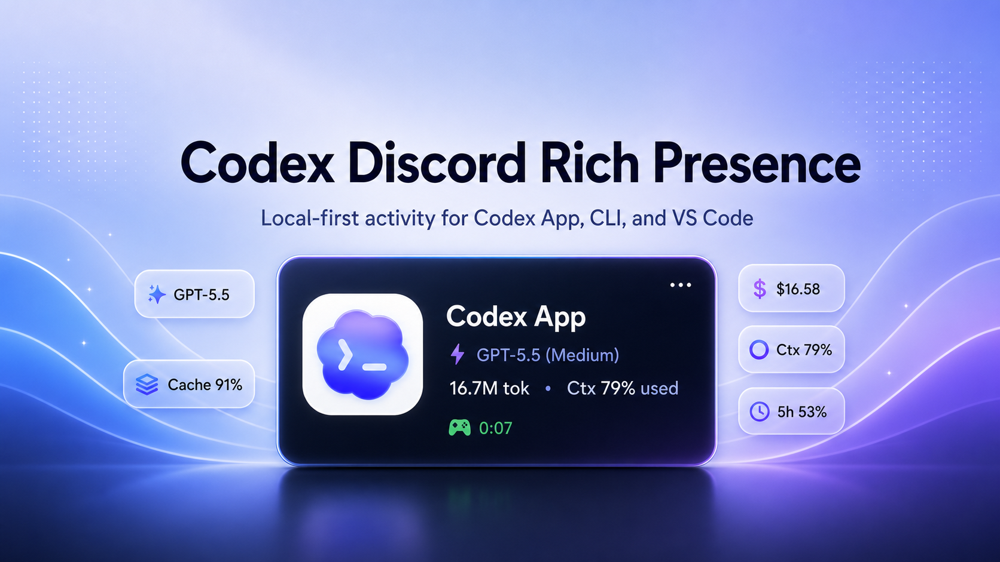
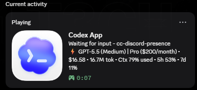
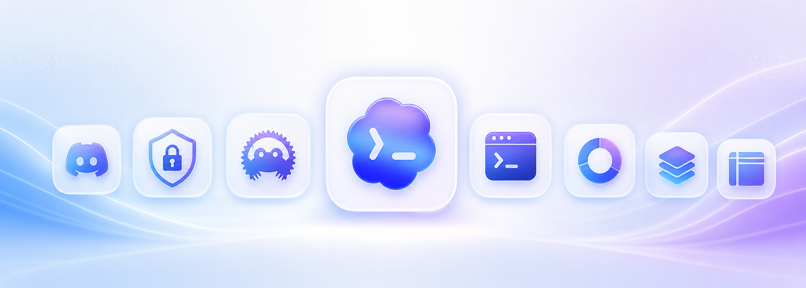

# Codex Discord Rich Presence

<div align="center">

<picture>
  
</picture>

### Local-first activity for Codex App, ChatGPT App, CLI, VS Code, and OpenCode.

One Rust runtime for **identity**, **model**, **cost**, **cache**, **context**, semantic **quota visibility**, and **Credits** — with no cloud telemetry.

<p>
  <a href="https://github.com/xt0n1-t3ch/Codex-Discord-Rich-Presence/releases/latest"></a>
  <a href="https://github.com/xt0n1-t3ch/Codex-Discord-Rich-Presence/actions/workflows/ci.yml"></a>
  <a href="https://openai.com/codex/"></a>
  <a href="https://discord.com/developers/docs/rich-presence/overview"></a>
  <br>
  <a href="https://www.rust-lang.org/"></a>
  <a href="https://ratatui.rs/"></a>
  
  
</p>

<sub>
  <a href="https://github.com/xt0n1-t3ch/Codex-Discord-Rich-Presence/releases/latest">Release</a> ·
  <a href="https://github.com/xt0n1-t3ch/Codex-Discord-Rich-Presence/actions/workflows/ci.yml">CI</a> ·
  <a href="https://openai.com/codex/">OpenAI Codex</a> ·
  <a href="https://discord.com/developers/docs/rich-presence/overview">Discord RPC</a> ·
  <a href="https://www.rust-lang.org/">Rust</a> ·
  <a href="https://ratatui.rs/">Ratatui</a>
</sub>

<a href="#install"><b>Install</b></a>&nbsp; · &nbsp;<a href="#whats-new"><b>What's New</b></a>&nbsp; · &nbsp;<a href="#about"><b>About</b></a>&nbsp; · &nbsp;<a href="#screenshots"><b>Screenshots</b></a>&nbsp; · &nbsp;<a href="#features"><b>Features</b></a>&nbsp; · &nbsp;<a href="#usage"><b>Usage</b></a>&nbsp; · &nbsp;<a href="docs/"><b>Docs</b></a>

</div>

---

<h2 id="whats-new"> &nbsp;What's New in v1.8.0</h2>

- **Truthful usage** - quota names come from their actual window duration, all global/model scopes survive normalization, and missing five-hour windows stay missing.
- **Real Credits** - account Credits support exact balances, explicit zero, unlimited, absence, and individual privacy control.
- **Fast without inheritance bugs** - explicit session speed wins; only unknown sessions fall back to `config.toml`, then legacy global state, and Fast renders as `⚡ Fast`.
- **One composer** - `codex-presence-core` 1.0.0 owns deterministic field order, details/state zones, compact/descriptive labels, presets, and Discord's 128-character boundary.

<details>
<summary>Previous v1.7.5 highlights</summary>

- **Shared live control** — Pulse and the standalone daemon now read the same persisted config on every poll, so design and all ten privacy fields take effect without restarting either process.
- **Durable master switch** — press `M`, or use Pulse's Rich Presence toggle, to clear Discord once and enter a truthful `Paused` state while local session monitoring continues.
- **Reliable resume** — turning presence back on invalidates the prior payload and publishes the current session again through the selected Codex App, ChatGPT App, CLI, or VS Code identity.
- **Last-good resilience** — an incomplete, invalid, or transiently replaced config is logged and ignored; the running process keeps its last valid settings instead of crashing.
- **Schema-12 migration** — existing schema-11 users remain enabled by default, and explicit paused state persists across both products.

</details>

**[Download the latest release](https://github.com/xt0n1-t3ch/Codex-Discord-Rich-Presence/releases/latest)** &nbsp;·&nbsp; **[Full changelog](CHANGELOG.md)**

<h2 id="about"> &nbsp;About</h2>

Codex already knows what you are doing: which session is active, which model is working, how much context is used, how many tokens came from cache, and whether the session is still alive. Discord sees none of that by default.

**Codex Discord Rich Presence bridges that gap locally.** It reads Codex and OpenCode session data from your machine, normalizes it into one usage snapshot, and renders two outputs from the same truth:

- a Discord Rich Presence card with the right Codex identity and clean activity text;
- a Ratatui terminal dashboard for live model, plan, cost, cache, context, and quota visibility.

No hosted service. No account sync. No transcript upload. Just a Rust daemon that watches local files and publishes the presence fields you choose.

<h2 id="screenshots"> &nbsp;Screenshots</h2>

<div align="center">



<sub><b>Discord Rich Presence</b> — Codex App branding · GPT model · plan · tokens · cost · context · quota windows.</sub>


</div>

<h2 id="install"> &nbsp;Install</h2>

Download a Windows, macOS, or Linux binary from [GitHub Releases](https://github.com/xt0n1-t3ch/Codex-Discord-Rich-Presence/releases/latest).

```powershell
codex-discord-presence status
codex-discord-presence doctor
codex-discord-presence
```

Windows local artifact:

```powershell
.\releases\windows\codex-discord-rich-presence.exe
```

### Build from source

```powershell
git clone https://github.com/xt0n1-t3ch/Codex-Discord-Rich-Presence.git
cd Codex-Discord-Rich-Presence
cargo build --release
```

<h2 id="features"> &nbsp;Features</h2>

<div align="center">



<sub><b>One local runtime</b> — Discord status, privacy controls, Rust daemon, terminal dashboard, cache, context, and session layout from one snapshot.</sub>

</div>

### Discord Rich Presence

| | |
| :--- | :--- |
| **Exact surface identity** | `Codex CLI`, `Codex VS Code Extension`, and desktop sessions are classified from session metadata first and launcher lineage second; unrelated open apps cannot contaminate the result. |
| **Readable activity** | Thinking, reading, editing, running, waiting, and idle states stay short enough for Discord while preserving the useful target when configured. |
| **Model + plan line** | GPT-5.6 App labels, reasoning effort, session-scoped Fast markers, and `Pro 5x` / `Pro 20x` display labels resolve from shared contracts. |
| **Cost + cache truth** | Input, cached input, output, cache hit ratio, cached-input savings, and total cost are computed before Discord rendering, not recomputed inside the payload formatter. |
| **Context and quota windows** | GPT-5.6 resolves observed JSONL first, local Codex model cache second, and bundled 353.4K usable context last, while preserving the 372K raw inventory value. |

### Terminal dashboard

| | |
| :--- | :--- |
| **Codex-first header** | Large centered wordmark, local-first subtitle, spinner, mode, Discord state, and poll cadence. |
| **Responsive layouts** | Full, compact, and minimal views keep terminal output readable across Windows Terminal, macOS Terminal, Linux terminals, and small panes. |
| **Plan picker** | Press `P` to choose Auto Detect, Free, Go, Plus, Pro 5x, Pro 20x, Business, or Enterprise. |
| **Desktop design toggle** | Press `D` to switch and persist `Codex App` or `ChatGPT App`; Discord reconnects to the matching application identity. |
| **Master presence toggle** | Press `M` to persistently pause or resume Discord publication without stopping local session monitoring. |
| **Usage snapshot** | Cost, cache hit ratio, savings, uptime, spend trend, limits, and recent sessions share the same runtime snapshot as Discord. |
| **No forced image protocol** | The repo owns both Codex App and ChatGPT App source art; the terminal uses text-first rendering so it stays portable. |

### Local diagnostics

| Command | Purpose |
| :--- | :--- |
| `codex-discord-presence status` | Print current detection state, active sessions, surface, model, plan, context, and session roots. |
| `codex-discord-presence doctor` | Check Discord IPC, config, assets, session paths, and runtime assumptions. |
| `codex-discord-presence` | Start the foreground Ratatui dashboard and Discord broadcaster. |

<h2 id="what-makes-it-cool"> &nbsp;What makes it cool</h2>

| Capability | This runtime | Generic presence scripts |
| :--- | :---: | :---: |
| Exact CLI / VS Code / desktop identity | ✓ | — |
| GPT-5.6 effort and session-scoped Fast display | ✓ | — |
| 372K raw / 353.4K usable context provenance | ✓ | — |
| Cache hit ratio and cached-input savings | ✓ | — |
| Ratatui live dashboard | ✓ | — |
| Local-only session reading | ✓ | varies |
| Cross-platform Rust daemon | ✓ | varies |

<h2 id="model-context-and-cost-tracking"> &nbsp;Model, context, and cost tracking</h2>

| Runtime lane | Value | Behavior |
|:---|---:|:---|
| GPT-5.6 raw context | 372,000 | Inventory value from the local Codex 0.144.0 model catalog. |
| GPT-5.6 usable context | 353,400 | Observed App value at 95%; JSONL overrides local cache, which overrides the bundled catalog. |
| GPT-5.6 cache-write telemetry | Not emitted by Codex JSONL | Known subtotal is marked `partial`; no zero-cost write is invented. |
| GPT-5.6 Fast economics | Not published | Fast remains visible, but cost completeness is `partial` until a multiplier is verified. |
| Unknown models | No fallback | Cost is unavailable unless a valid user override exists. |

Example Discord state line:

```text
GPT-5.6 Sol · Max · ⚡ Fast | Pro 20x ($200/month) · >=$7.37 · 38.9M tok · Ctx 1% used · 5h 41% · 7d 47%
```

<h2 id="usage"> &nbsp;Usage</h2>

**First launch** → start `codex-discord-presence` → keep using Codex. The daemon scans local session roots and publishes the current activity to Discord.

**Change plan display** → press `P` in the terminal → choose Auto Detect or a manual tier. `Pro 5x ($100/month)` and `Pro 20x ($200/month)` are separate options.

**Change desktop design** → press `D` in the terminal → the persisted schema-13 setting alternates between `Codex App` and `ChatGPT App`.

**Pause or resume Discord** → press `M` in the terminal → schema 13 persists the same `presence_enabled` switch used by Pulse. Pausing clears the current card but keeps local monitoring active.

**Hide sensitive fields** → edit `~/.codex/discord-presence-config.json` and toggle privacy fields such as project, branch, activity, tokens, cost, and limits.

**Use WSL sessions on Windows** → opt in explicitly before launch:

```powershell
$env:CODEX_PRESENCE_INCLUDE_WSL = "1"
```

<h2 id="configuration"> &nbsp;Configuration</h2>

Config lives at `~/.codex/discord-presence-config.json`.

| Variable | Purpose |
|:---|:---|
| `CODEX_HOME` | Use a custom Codex home directory. |
| `CODEX_PRESENCE_POLL_SECONDS` | Override daemon poll interval. |
| `CODEX_PRESENCE_STALE_SECONDS` | Override session stale cutoff. |
| `CODEX_PRESENCE_ACTIVE_STICKY_SECONDS` | Override active-session stickiness window. |
| `CODEX_PRESENCE_SURFACE` | Explicit fallback identity: `cli`, `vscode`, or `desktop`; active JSONL metadata remains authoritative. |
| `CODEX_PRESENCE_INCLUDE_WSL=1` | Opt in to scanning WSL Codex session roots on Windows. Off by default. |
| `CC_PRESENCE_INCLUDE_WSL=1` | Compatibility alias for the same WSL opt-in. |

<h2 id="project-map"> &nbsp;Project map</h2>

| Path | Purpose |
|:---|:---|
| `src/app.rs` | Daemon loop, process and surface hints, Discord update cadence. |
| `src/config.rs` | Runtime configuration, session roots, identity defaults, migration, and WSL opt-in policy. |
| `src/model.rs` + `src/model_catalog.json` | Model identities, labels, efforts, speed capabilities, context provenance, rates, credits, and sources. |
| `src/cost.rs` | Cost arithmetic, completeness, overrides, reconciliation, and cache savings. |
| `src/discord.rs` | Discord IPC payloads, asset policy, and sticky surface branding. |
| `src/metrics.rs` | Usage, cost, cache, and context metrics. |
| `src/session.rs` + `src/session/*` | Codex JSONL collection, parsing, activity, and context-window state. |
| `src/ui.rs` | Ratatui terminal dashboard and layout contracts. |
| `assets/branding/` | Codex App and ChatGPT App source art, README visuals, and badge policy. |
| `docs/` | Runtime, UI, and local schema contracts. |
| `tests/` | Integration map and regression coverage. |

<h2 id="docs"> &nbsp;Documentation</h2>

- [Runtime API contract](docs/api/codex-presence.md)
- [Local schema map](docs/database/schema.md)
- [Terminal UI sitemap](docs/ui/UI_SITEMAP.md)
- [Test suite map](tests/index.md)

<h2 id="roadmap"> &nbsp;Roadmap</h2>

- **Signed release installers** — publish first-class Windows/macOS/Linux packages with checksums and a cleaner install path.
- **Discord field presets** — expose Minimal, Standard, Full, and privacy-first templates directly in the standalone runtime.
- **Terminal screenshots in CI** — render Ratatui buffers as deterministic preview assets for README and release notes.
- **Pulse sync gate** — keep the standalone Codex core and Pulse mirror in lockstep with a contract diff check.

<h2 id="contributing"> &nbsp;Contributing</h2>

PRs are welcome. Please keep changes local-first, tested, and focused. Use the repo-native validators before opening a PR:

```powershell
cargo fmt --check
cargo clippy --workspace --all-targets -- -D warnings
cargo test --workspace
cargo build --release
```

<h2 id="security"> &nbsp;Security</h2>

This runtime reads local Codex/OpenCode session files and publishes configured Discord Rich Presence fields. Do not include secrets, transcripts, tokens, or private prompts in public issues. Use [GitHub Security Advisories](https://github.com/xt0n1-t3ch/Codex-Discord-Rich-Presence/security/advisories/new) for private reports.

<h2 id="privacy"> &nbsp;Privacy</h2>

Codex Discord Rich Presence is local-first:

- reads local Codex and OpenCode session files;
- publishes only Discord Rich Presence fields you configure;
- does not run a telemetry server;
- does not sync transcripts to a cloud dashboard;
- keeps WSL scanning disabled unless you opt in.

See [PRIVACY.md](PRIVACY.md) for the short policy.

<h2 id="license"> &nbsp;License</h2>

[MIT](LICENSE) © 2026 xt0n1-t3ch.

---

<div align="center">
<sub>Built with Rust, Ratatui, Discord Rich Presence, and Codex. &nbsp; · &nbsp; <a href="https://github.com/xt0n1-t3ch/Codex-Discord-Rich-Presence">github.com/xt0n1-t3ch/Codex-Discord-Rich-Presence</a></sub>
</div>
