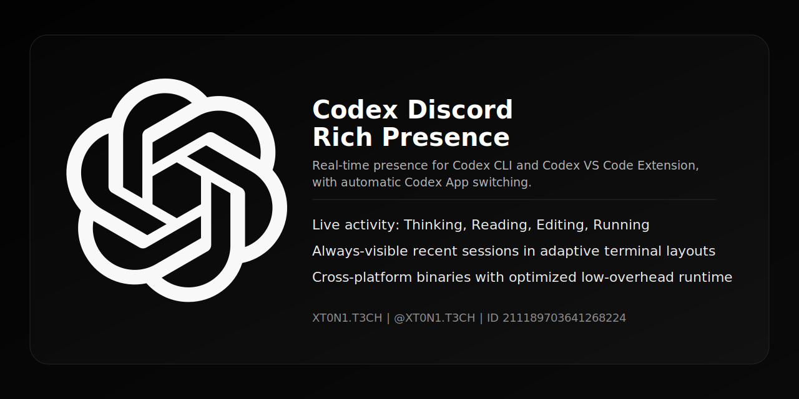
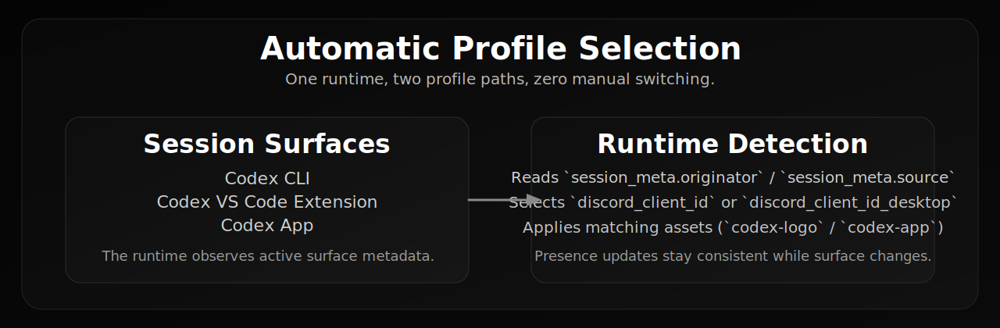
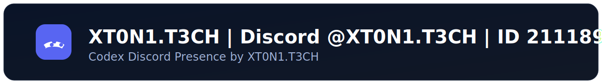

# Codex Discord Rich Presence

<p align="center">
  
</p>

<p align="center">
  <a href="https://github.com/xt0n1-t3ch/Codex-Discord-Rich-Presence/actions/workflows/ci.yml"></a>
  <a href="https://github.com/xt0n1-t3ch/Codex-Discord-Rich-Presence/actions/workflows/release.yml"></a>
  <a href="https://github.com/xt0n1-t3ch/Codex-Discord-Rich-Presence/releases"></a>
  <a href="LICENSE"></a>
  
  
</p>

<p align="center"><strong>Elegant, real-time Discord Rich Presence for Codex CLI, Codex VS Code Extension, and Codex App.</strong></p>

## Overview

Codex Discord Rich Presence is a lightweight Rust runtime that reads local Codex session telemetry and publishes polished Discord activity in real time.

It automatically detects whether your active session is coming from:

- Codex CLI
- Codex VS Code Extension
- Codex App (Windows, Linux, macOS)

and switches branding, client ID, and visual assets accordingly.

<p align="center">
  
</p>

## Highlights

- Automatic surface-aware switching between Codex CLI, Codex VS Code Extension, and Codex App.
- Stable and readable activity states (`Thinking`, `Reading`, `Editing`, `Running`, `Waiting for input`).
- Low-overhead runtime with adaptive rendering, payload dedupe, and reconnect backoff.
- Persistent idle card behavior for better Discord continuity.
- Global-first quota interpretation (`limit_id=codex`) for 5h/7d indicators.
- Model, cost, and token telemetry with compact formatting.
- Cross-platform release outputs for Windows, Linux, and macOS.

## Surface Behavior

| Active Surface | Discord App Profile | Client ID Field | Main Large Asset |
| --- | --- | --- | --- |
| Codex CLI / Codex VS Code Extension | `Codex` | `discord_client_id` | `codex-logo` |
| Codex App Desktop | `Codex App` | `discord_client_id_desktop` | `codex-app` |

Detection source:

- Primary: `session_meta.originator` contains `desktop`.
- Fallback: `session_meta.source` contains `desktop`.
- Otherwise: Codex CLI / Codex VS Code Extension profile.

## Quick Start

1. Configure Discord assets in your Developer applications:
   - Codex CLI / Codex VS Code Extension app: `codex-logo`, `openai`.
   - Codex App desktop app: `codex-app`, `openai`.
2. Build locally:
   - Windows: `./scripts/build-release.ps1`
   - Linux/macOS: `./scripts/build-release.sh`
3. Run the app:
   - `codex-discord-presence`
4. Verify runtime health:
   - `codex-discord-presence status`
   - `codex-discord-presence doctor`

## Install and Release Artifacts

Build from source:

```bash
cargo build --release
```

Published binaries:

- [GitHub Releases](https://github.com/xt0n1-t3ch/Codex-Discord-Rich-Presence/releases)

Artifact layout:

- `releases/windows/codex-discord-rich-presence.exe`
- `releases/linux/codex-discord-rich-presence`
- `releases/macos/codex-discord-rich-presence`
- `releases/macos/codex-discord-rich-presence-x64` (CI matrix artifact)
- `releases/macos/codex-discord-rich-presence-arm64` (CI matrix artifact)

Windows executable icon is embedded from:

- `assets/branding/codex-app.png`

## Command Reference

```bash
codex-discord-presence
codex-discord-presence codex [args...]
codex-discord-presence status
codex-discord-presence doctor
```

## Configuration Essentials

Config file:

- `~/.codex/discord-presence-config.json`

Key defaults:

- `schema_version`: `7`
- `discord_client_id`: `1470480085453770854`
- `discord_client_id_desktop`: `1478395304624652345`
- `display.large_image_key`: `codex-logo`
- `display.desktop_large_image_key`: `codex-app`
- `display.desktop_large_text`: `Codex App`
- `display.small_image_key`: `openai`
- `privacy.show_cost`: `true`
- `openai_plan.show_price`: `true`
- `poll_interval_seconds`: `2`

Environment overrides:

- `CODEX_DISCORD_CLIENT_ID`
- `CODEX_DISCORD_CLIENT_ID_DESKTOP`
- `CODEX_PRESENCE_STALE_SECONDS`
- `CODEX_PRESENCE_POLL_SECONDS`
- `CODEX_PRESENCE_ACTIVE_STICKY_SECONDS`
- `CODEX_HOME`

## Runtime Quality

- Native Rust binary (no Electron runtime).
- Release profile tuned for low footprint:
  - `lto=thin`
  - `panic=abort`
  - `strip=true`
  - `codegen-units=1`
- Adaptive TUI polling reduces idle CPU usage.
- Presence heartbeat and reconnect strategy improve Discord IPC resiliency.

## CI and Release Pipelines

- CI matrix validates Linux, macOS, and Windows on every push/PR.
- Release matrix builds platform artifacts for:
  - `x86_64-unknown-linux-gnu`
  - `x86_64-apple-darwin`
  - `aarch64-apple-darwin`
  - `x86_64-pc-windows-msvc`

## Documentation

- [Docs Index](docs/README.md)
- [CLI and Presence Contract](docs/api/codex-presence.md)
- [Local Data / Schema Contracts](docs/database/schema.md)
- [TUI Information Architecture](docs/ui/UI_SITEMAP.md)

## Security and Privacy

- Reads local Codex session files only.
- No external telemetry pipeline is used by this project.
- See [PRIVACY.md](PRIVACY.md) and [SECURITY.md](SECURITY.md).

## OpenAI Brand Note

OpenAI marks and logos are trademarks of OpenAI.  
Follow official brand policy: https://openai.com/brand/

## Credits

<p align="center">
  
</p>

## License

MIT ([LICENSE](LICENSE))
